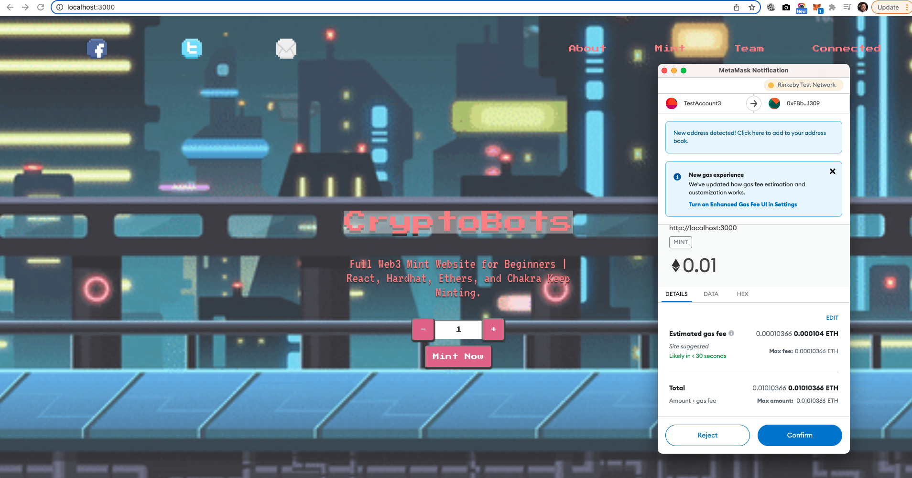
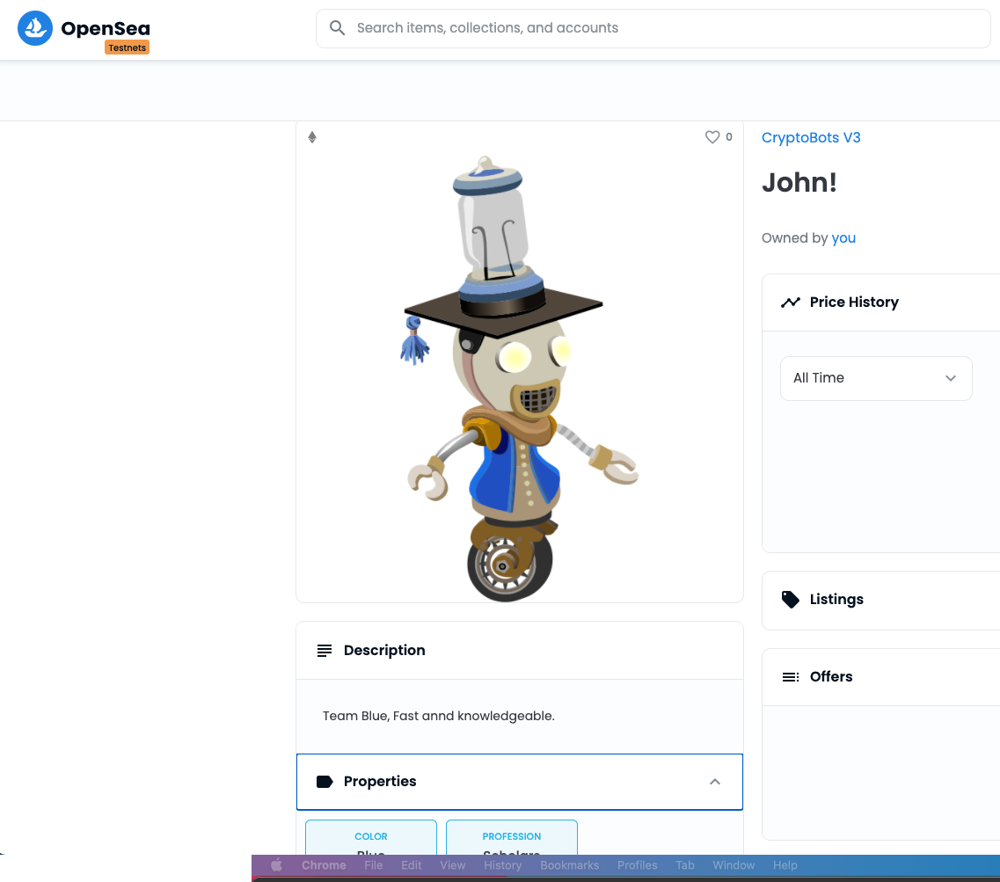
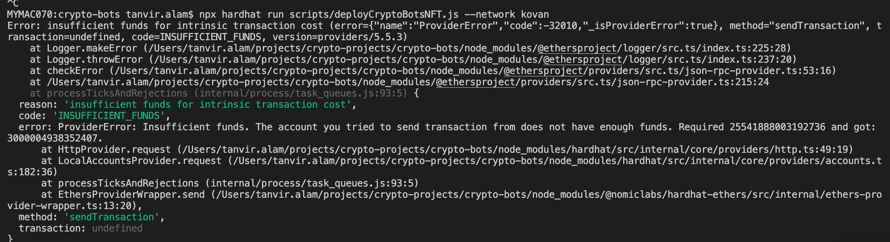
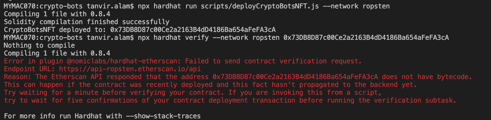
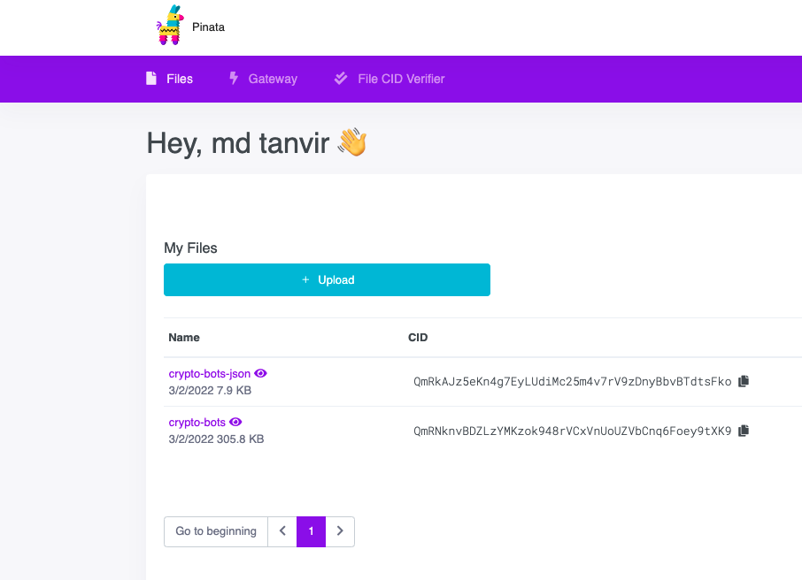
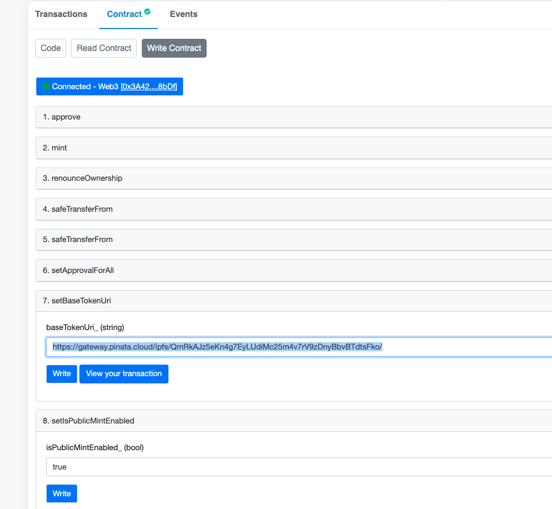

#How it the page is expected to look like



#How my minted token expected to look like


#Problem refarding faucet funding for testnet.

First problem started with funding Metamask Account for RINKEYBY testnet. https://faucet.rinkeby.io/ was offline and was not funding the account.
I did not know of other faucet of to fund, then we went for ROPSTEN Testnet. But token bought in ROPSTEN was not visible on opensea. So I 
switched back to RINKBY testnet and found https://www.rinkebyfaucet.com/ working to fund me 0.1 Ether

#Insufficient Fund to deploy contract
When I tried with less ether in my account and tried to deploy the contract, the following error showed up. Adding more ether solved that.




#Verification error
When I tried to deploy multiple times and tried to verify the contract, got following error. Just waiting longer for contract to reach
solved the problem



#IPFS How to
1. Downloaded 4 free images uploaded for reference in this directory IPFS-Sample/crypto-bots-images. Named them 1.png, 2.png to be able to match them token number.


2. Created Opensea supported  metadata in .json  file uploaded in IPFS-Sample/json named 1.json  , 2.json to match the token number
IPFS MetaData Format


OpenSea MetaData Format
{
  "description": "Friendly OpenSea Creature that enjoys long swims in the ocean.", 
  "external_url": "https://openseacreatures.io/3", 
  "image": "https://storage.googleapis.com/opensea-prod.appspot.com/puffs/3.png", 
  "name": "Dave Starbelly",
  "attributes": [ ... ], 
}

3. Created account in pinata and uploaded image folder to pinata

4.From the image upload copy the CID and use in json as shown in my example
5. then upload json files to pinata, then copy the CID to use in SetBaseTokenUri function of the contract

both of the format  in use by developers and they work , trailing slash is important to create the tokenURI

ipfs://QmRDEhce1xfQXifQtgzTBdLkj1G4HEB5R5YiqrA6SXEtX7/
gateway.pinata.cloud/ipfs/QmRDEhce1xfQXifQtgzTBdLkj1G4HEB5R5YiqrA6SXEtX7/



readme-assets/contract on etherscan.png

#Command Ran

```shell
npx create-react-app crypto-bots
npm i -D hardhat
npx hardhat
npm i @openzeppelin/contracts
npm i @chakra-ui/react @emotion/react@^11 @emotion/styled@^11 framer-motion@^6
npm i -D dotenv
npx hardhat clean
npx hardhat compile
npx hardhat run scripts/deployCryptoBotsNFT.js --network rinkeby
npm i -D @nomiclabs/hardhat-etherscan
npx hardhat verify --network rinkeby 0xFBb0b7c320AAdA50f99a615bb9A958815CC71309
npm run start
 
```

#Background Image and Token image Credit:
Yog Joshi Art
@YogJoshiArt
https://giphy.com/gifs/side-scroller-sidescrolling-scrolling-U7huVmA3TKuqvznInJ
https://freesvg.org

